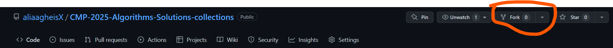
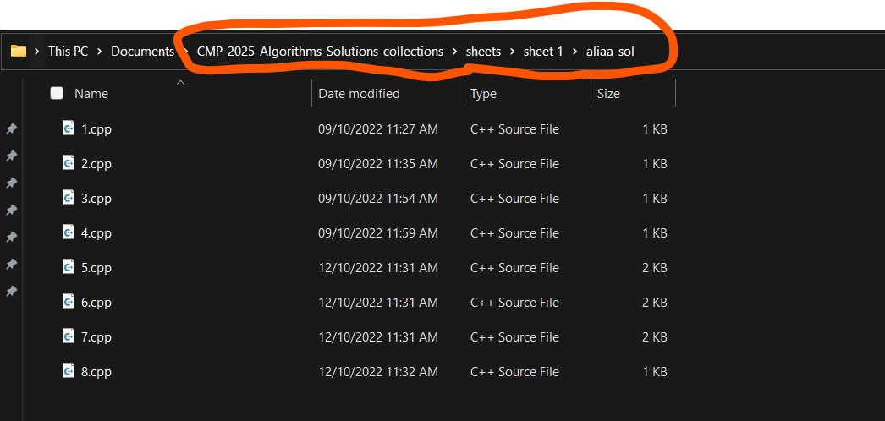

## Steps to add your solution

### 1 - fork the repo



### 2 - clone the repo

Open a terminal and run the following git command \
**replace <username> with your github username**

```git clone https://github.com/<username>/CMP-2025-Algorithms-Solutions-collections.git```

### 3 - Create a branch

first enter the directory \
```cd CMP-2025-Algorithms-Solutions-collections``` \
then create new branch with name you like \
```git checkout -b your-branch-name```

### 4 - add your changes

make a folder with any name in one of three folders and add your solutions


### 5 - commit those changes

```git add *```

commit with any message you want

```git commit -m "add mysolutions to sheet 1"```

### 5 - Push changes to GitHub

```git push origin -u your-branch-name```

🛑 **Don't add solution to the labs or assignments tell the deadline end !!**
